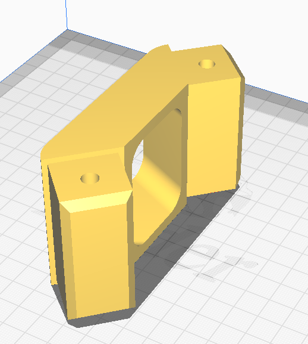

# 3D printed parts

---
Some of the parts are 3D printed.
Printing settings:

- PLA is good enough
- around 5 walls, for strenght
- infil around 50%, alos for strenght
- supports: mostly no

We also printed the whole module (except for axels and bearings) and it kinda works. Of course we don't recomend using it, most parts should be made of steel and aluminium.
