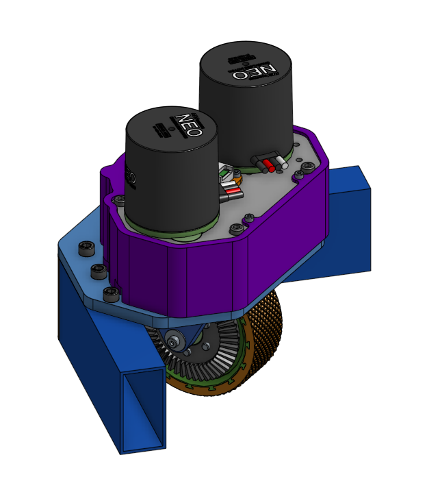

# Rabyte_Swerve_Module

---

#8127's custom swerve module design and documentation

Basic characteristic:

- as metric as possibile
- using NEOs for both driving and steering
- using Redux HELIUM Canandcoders
- custom polyurethane casted wheels
- 30x60mm profiles for frame
- some 3D printed parts
- gears are modified off the shelf metric gears
- 7:64 steering ratio
- 1:7 or 4:21 drive ratio (1 gear swap)
- the design is based on the SDS mk4.

**[Onshape link](https://cad.onshape.com/documents/77f17ba6a9909df0f0190ebf/w/6d8127f64ed0d1f2707c88a1/e/b61e76f2111f9b8cf438d247?configuration=List_nrWpZ4TijIZ2aF%3D_12t&renderMode=0&uiState=65428b70dc56e20d79b81c6c)**

