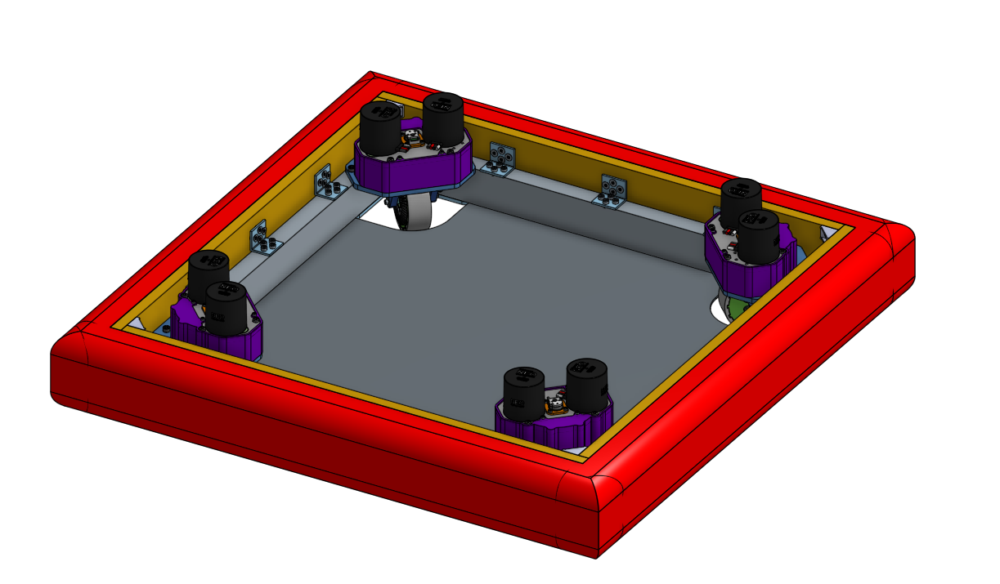

# Rabyte_Swerve_Module

---

#8127's custom swerve module design and documentation

## Basic characteristics

- as metric as possibile
- using NEOs for both driving and steering
- using Redux HELIUM Canandcoders
- custom polyurethane cast wheels with printed cores
- 30x60mm profiles for frame
- some 3D printed parts
- gears are modified off-the-shelf metric gears
- 7:64 steering ratio
- 1:7 or 4:21 drive ratio (1 gear swap)
- the design is based on the SDS mk4.

## **[Onshape link](https://cad.onshape.com/documents/77f17ba6a9909df0f0190ebf/w/6d8127f64ed0d1f2707c88a1/e/b61e76f2111f9b8cf438d247?configuration=List_nrWpZ4TijIZ2aF%3D_12t&renderMode=0&uiState=65428b70dc56e20d79b81c6c)**

## December updates

- 3d printed cover
- new wheel and mould design
- ctre cancoder configuraton
- botom bracket instead of nuts
- config without frame profiles, for easier cad asembly
- added neo spacers, for more clearance

## Drivebase

We designed custom drivebase based on our modules, we are planing to use it in competition.
Onshape link: [drivebase cad link](https://cad.onshape.com/documents/012b6aa6ca8f98a975c3e93b/w/7b513a2cf96c4c9739c20c7f/e/b5b0c5cf1ca33fb7e982671a?renderMode=0&uiState=65919a7765a59c04a1a69403)

