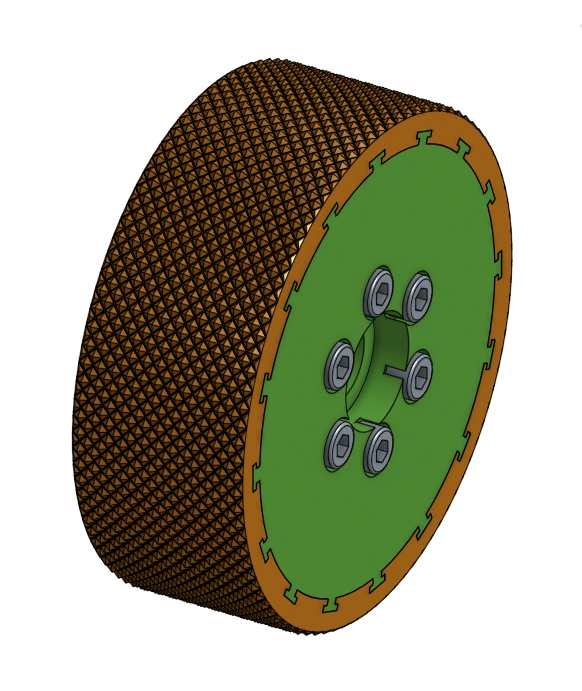
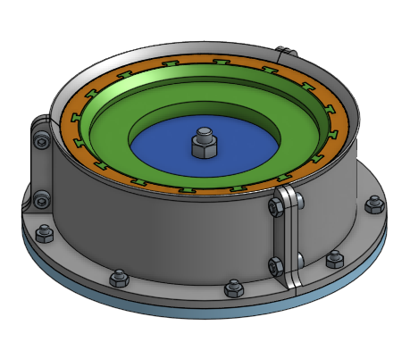

# Custom wheels

---

We designed custom 3D printed wheeel with tires casted out of polyurethane. We also did some experiments on how to cast such wheels.

Both  hub and mould are 3D printed. We used 70 shore A polyurethane. That is probably too hard. For the mould release we recomend polivynyl alcohol(pva).

